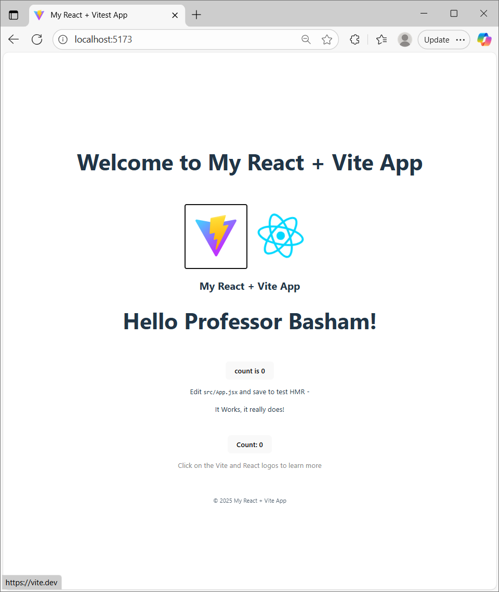
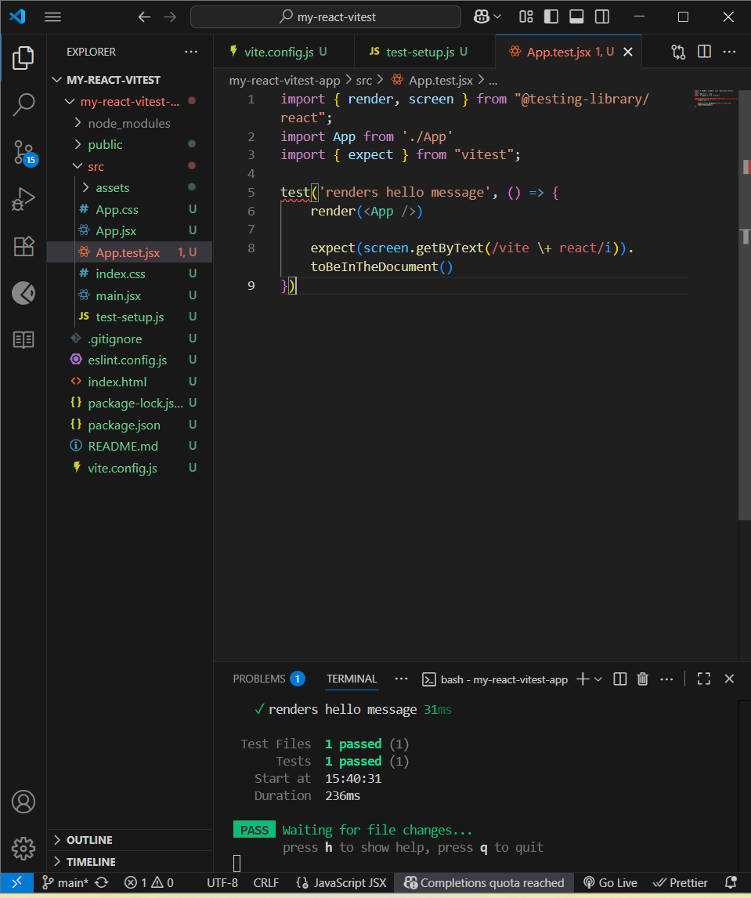
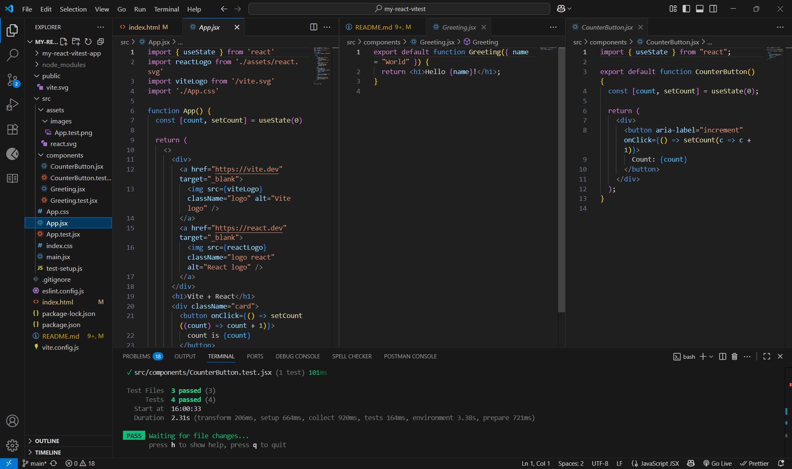
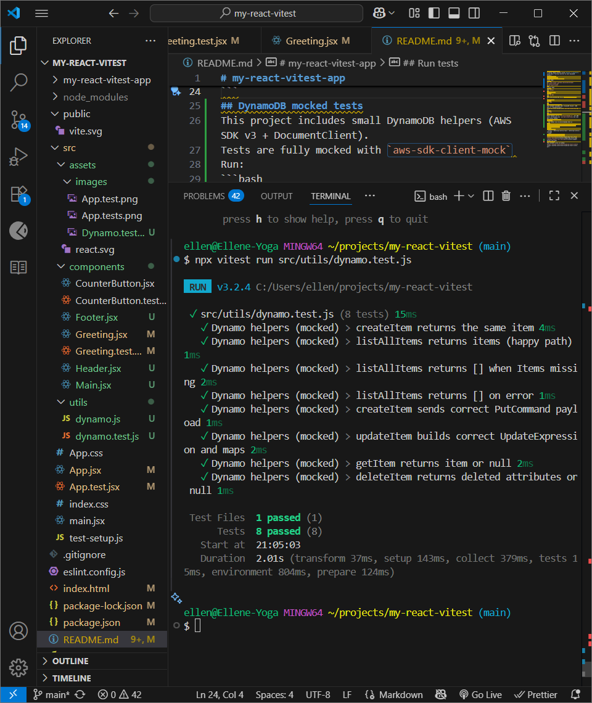

# my-react-vitest-app
 A starter React project using **Vite** + **Vitest**. (with React Testing Library) an mock DynamoDB helpers.
## Requirements
- Node 18+ and npm
## Getting started and Setup
clone repo:
```bash
git clone https://github.com/ellene-broome/my-react-vitest.git
cd my-react-vitest
```
install deps
```bash
npm install
```
## Run the app
```bash
npm run dev
```
Open the printed URL (e.g. http://localhost:5173
).
## Run tests
```bash
npm test
```
## DynamoDB mocked tests
This project includes small DynamoDB helpers (AWS SDK v3 + DocumentClient).
Tests are fully mocked with `aws-sdk-client-mock` 
Run:
```bash
npm test
```
## DynamoDB mocked tests
Small helpers are in `src/utils/dynamo.js`. All AWS calls are mocked with `aws-sdk-client-mock`—no real AWS access needed.
- Run these tests only:
  ```bash
  npx vitest run src/utils/dynamo.test.js
  ```
- What’s covered: `listAllItems`, `createItem`, `getItem`, `updateItem`, `deleteItem` (payload assertions included).
## Tech
- Vite + React
- Vitest + @testing-library/react + @testing-library/jest-dom
- jsdom
- aws-sdk v3-sdk-client-mock 
## ScreenShot 
- Tests Passing
 
- More tests passing

- Dynamotests passing

## Repository
This project lives on GitHub:  
[https://github.com/ellene-broome/my-react-vitest](https://github.com/ellene-broome/my-react-vitest.git)
