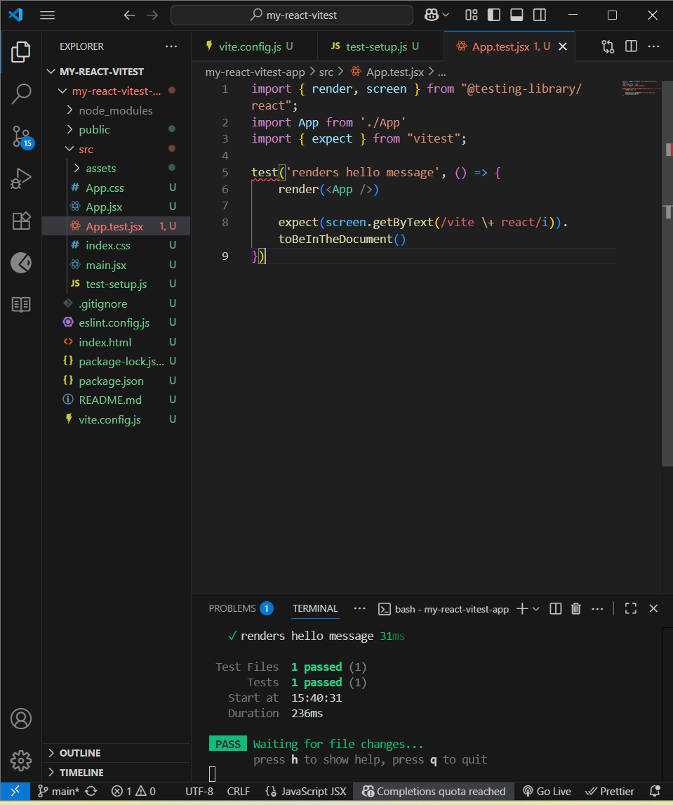

# my-react-vitest-app

A starter React project using Vite + Vitest.

## Requirements
- Node 18+ and npm

## Setup
```bash
npm install
```

## Run the app
```bash
npm run dev
```

Open the printed URL (e.g. http://localhost:5173
).

## Run tests
```bash
npm test
```
## Tech
- Vite + React
- Vitest + Testing Library + jsdom
## ScreenShot

## Repository

This project lives on GitHub:  
[my-react-vitest-app](https://github.com/ellene.broome/my-react-vitest)
